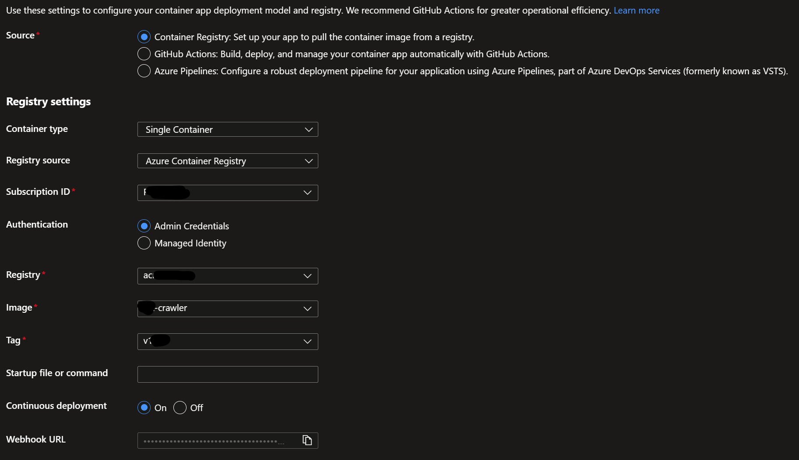
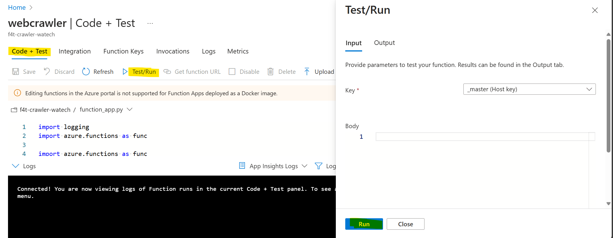

# Introduction

The web crawler is an add-on component for RAG based chat solutions, like the Chat bot [solution accelerator](https://github.com/Azure-Samples/azure-search-openai-demo). It showcases how to populate an Azure AI Search index with chunked and vectorized (i.e. embedded) content gathered from a public website.

# Sample Code

This repository contains sample code intended for demonstration purposes.  The code is provided as-is and may require modifications to fit specific use cases or production environments.

# Getting Started

## Deployment Options

The crawler can be deployed in two ways:

### Option 1: Azure Developer CLI (azd) Deployment (Recommended)

The quickest way to deploy the Web Crawler Function is using the Azure Developer CLI (azd). This method will automatically provision all required resources and deploy the application.

**NOTE:** If you're using the Azure Cloud Shell you can skip steps 1 and 2.

1. **Prerequisites**
   - [Install Azure Developer CLI (azd)](https://learn.microsoft.com/en-us/azure/developer/azure-developer-cli/install-azd)
   - [Azure subscription](https://azure.microsoft.com/free/)
   - [Azure CLI](https://learn.microsoft.com/en-us/cli/azure/install-azure-cli)

2. **Login to Azure**
   ```bash
   az login
   azd auth login
   ```

3. **Initialize Azure Developer Environment**
   ```
   # Clone this repository
   git clone https://github.com/cmw2/crawler-pa
   cd crawler-pa
   
   # Initialize the Azure Developer environment
   azd init
   ```

4. **Set Environment Variables**
   
   Before deployment, set the crawler configuration variables using the `azd env set` command. These variables will be used during deployment to configure your function app.  At a minimum you need to set either BASE_URLS or CRAWL_URLS, though there are several others to consider.  See the Configure Crawler Function section below for more detail.

   Here is an example of the essentials

   ```bash
   azd env set BASE_URLS "http://www.example.com"
   azd env set INCLUDE_DOMAINS "example.com"
   azd env set EXTRACT_LINK_TYPE "html,pdf"  # Default: html,pdf
   azd env set DEPTH 99
   ```
   You can review your settings with

   ```bash
   azd env get-values
   ```

5. **Provision and Deploy**

   It's a good idea to run a preview of what will be deployed with the below command.  You'll be prompted to select the Azure subscription and the region (aka location).  
   
   ```bash
   azd provision --preview
   ```

   Now, we can provision resources and deploy the crawler to Azure.  This will take several minutes.

   ```bash   
   azd up
   ```

   This command will:
   - Create a new resource group (or use an existing one)
   - Provision all required Azure resources using Bicep templates
   - Build and push the Docker container image to the container registry
   - Deploy the function app
   - Configure all necessary settings

   **Azure Resources Created**

   The azd deployment creates the following resources:
   - Azure Function App (container-based)
   - Azure Container Registry
   - Azure Cosmos DB account
   - Azure AI Search service
   - Azure OpenAI service with embedding model
   - Azure Document Intelligence (Form Recognizer)
   - Azure Key Vault for securely storing credentials
   - Storage Account
   - App Service Plan

   **Resource Names**

   You can specify names for the resources using ```azd env set``` (see the main.bicep parameters) or you can let it use defaults.  By default it will use a pattern like:
   - \<abbr\>-\<environment\>-\<unique5characters\>, e.g.
   - func-crawlerazd-4uk7a

   The environment name is the name you provided when running azd init.  The abbreviation comes from the abbreviations.json file in this repo.  The unique characters are generated.

### Option 2: Manual Deployment

For more control over the deployment process, you can follow the manual deployment steps below.  This assumes the following resources already exist:

1. Azure AI Search

2. Azure Open AI

   Embedding model

3. Document Intelligence


#### Prerequisites for Manual Deployment

1. Create a resource group
1. [Create a Azure Container Registry.](https://learn.microsoft.com/en-us/azure/container-registry/container-registry-get-started-portal?tabs=azure-cli#sign-in-to-azure)
1. [Create Azure Cosmos DB account](https://learn.microsoft.com/en-us/azure/cosmos-db/nosql/quickstart-portal#create-account)

#### Enable Admin Account for ACR

[Follow the steps using the portal to enable the Admin account.](https://learn.microsoft.com/en-us/azure/container-registry/container-registry-authentication?tabs=azure-cli#admin-account)

#### Docker Image Creation and Push to Azure Container Registry

Change into the directory container the Dockerfile

```ps
cd <path-to-directory-with-Dockerfile>
```

Login to Azure Container Registry

```ps
az acr login --name <azure-container-registry-name> -t
```

Build the container image. You can change the --image name and tag as needed.

```ps
az acr build --image crawler/f4t-crawler:v1 --registry <azure-container-registry-name> --file Dockerfile .
```

#### Create Azure Function using Containers

1. Follow the steps to [create Azure Function App using containers.](https://learn.microsoft.com/en-us/azure/azure-functions/functions-how-to-custom-container?tabs=core-tools%2Cacr%2Cazure-cli&pivots=azure-functions#azure-portal-create-using-containers)

    **NOTE**: For hosting plan, choose App Service Plan.

1. Go to Deployment Center and select the options as shown below:

    

1. Click Save and switch to Logs tab to review logs for successful deployment.


## Configure Crawler Function

Add the following environment variables to the Azure Function App.

| Configuration | Description | Value Sample |
|---------------|-------------|-------|
| BASE_URLS     | The comma separated list of base urls to crawl. Links on this page will be extracted and crawled. | http://www.url1.com,http://www.url2.com |
| EXTRACT_LINK_TYPE | The type of links to extract when crawling Base Urls | pdf |
| CRAWL_URLS | The comma separated  list of urls to crawl. No links will be extracted and crawled, only the Urls will be crawled. | http://www.url1.com,http://www.url2.com |
| EXCLUDE_LIST | The comma separated list of urls to exclude from crawling. | http://www.url1.com,http://www.url2.com |
| INCLUDE_DOMAINS | The comma separated list of domains to include during crawling. | www.url1.com,www.url2.com |
| INDEX_NAME | The name of the index to create in AI Search. | gptkbindex7 |
| SEARCH_ENDPOINT | The endpoint for the AI Search service. | https://<search_name>.search.windows.net |
| SEARCH_KEY | The admin key for the AI Search service. | <search_admin_key> |
| EMBEDDING_MODEL_ENDPOINT | Azure Open AI text embedding model endpoint. | https://<open_ai_name>.azure.com/openai/deployments/text-embedding-ada-002/embeddings |
| EMBEDDING_MODEL_KEY | Azure Open AI key. | <open_ai_key> |
| ENABLE_VECTORS | Flag to enable/disable vector (embeddings) computations. | True = Enabled |
| FORM_RECOGNIZER_ENDPOINT | The Document Intelligence service endpoint. | https://<document_intelligence_name>.cognitiveservices.azure.com/ |
| FORM_RECOGNIZER_KEY | The Document Intelligence service key. | <document_intelligence_key> |
| NUM_OF_THREADS | The number of crawler threads. | 1 |
| COSMOS_URL | The Cosmos DB account endpoint for storing the crawler logs. | https://<cosmosdb_account>.documents.azure.com:443/ |
| COSMOS_DB_KEY | The key for Cosmos DB account. If no key is provided the crawler uses Managed Identity. | <cosmosdb_key> |
| DELAY | The number of seconds between crawl requests per thread. | 0 (default) |

**Note**: For all credentials and service keys, it is recommended that these are stored in Azure KeyVault for security reasons. Refer to documentation [here](https://learn.microsoft.com/en-us/azure/app-service/app-service-key-vault-references?tabs=azure-cli) for use of Azure KeyVault reference as app settings in Azure Function App.

## Running a Crawl
The crawler runs on a schedule controlled by the **SCHEDULE** setting.  It takes a standard unix cron expression.  The default value is '0 0 * * *' which runs at midnight every day.

To manually kick off a crawl:

1. Go to Overview page of the function app in the Azure Portal.
2. Select the webcrawler function and go to "Code + Test" and click "Test/Run" and "Run".

   


## Cleaning Up Azure Resources

When you're finished using the Web Crawler Function and its related resources, you can remove them. Follow these steps to delete all the resources:

### Option 1: Using Azure Developer CLI (azd)

If you deployed using Azure Developer CLI, you can easily remove all resources with a single command:

```bash
# This will delete all resources in your azd environment
azd down
```

Some of the resources support soft delete.  You'll be prompted to purge (aka permanently delete) them. To skip the confirmation, add the `--purge` flag:

```bash
azd down --purge
```

### Option 2: Manual Cleanup

If you deployed resources manually, follow these steps:

1. **Delete the Resource Group**
   
   The simplest way to remove all resources is to delete the entire resource group.  You can use the Azure Portal or you can run an az cli command:
   
   ```bash
   az group delete --name <your-resource-group-name>
   ```

2. **Selective Resource Deletion**
   
   If you want to keep some resources in the resource group, you can delete individual services:
   
   ```bash
   # Delete the Function App
   az functionapp delete --name <function-app-name> --resource-group <resource-group-name>
   
   # Delete Container Registry (if no longer needed)
   az acr delete --name <container-registry-name> --resource-group <resource-group-name>
   
   # Delete Cosmos DB account
   az cosmosdb delete --name <cosmosdb-account-name> --resource-group <resource-group-name>
   ```

3. **Verify Deletion**
   
   Ensure all resources are deleted by checking the Azure Portal or running:
   
   ```bash
   az resource list --resource-group <resource-group-name>
   ```

## DISCLAIMER
**This Sample Code is provided for the purpose of illustration only and is not intended to be used in a production environment. THIS SAMPLE CODE AND ANY RELATED INFORMATION ARE PROVIDED 'AS IS' WITHOUT WARRANTY OF ANY KIND, EITHER EXPRESSED OR IMPLIED, INCLUDING BUT NOT LIMITED TO THE IMPLIED WARRANTIES OF MERCHANTABILITY AND/OR FITNESS FOR A PARTICULAR PURPOSE.**